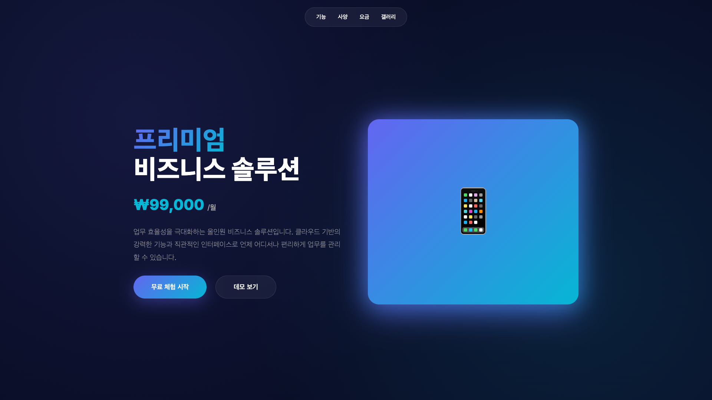
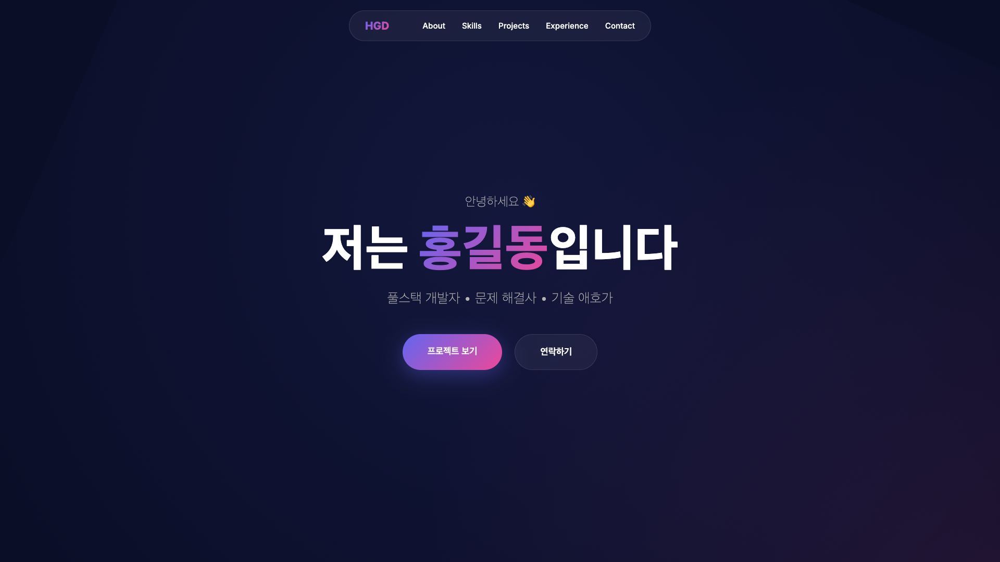
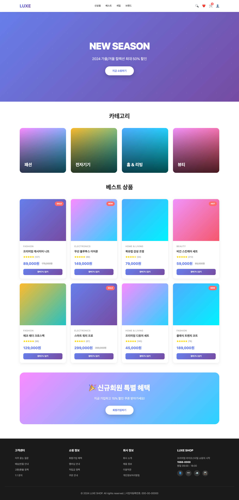
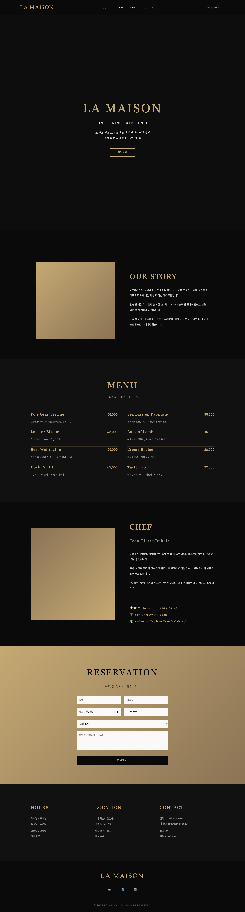
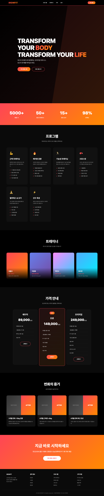
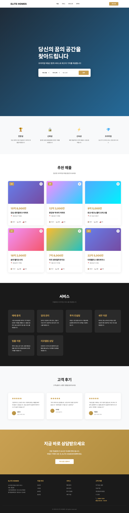
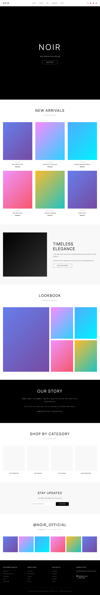

# 🎨 Modern Web Templates Collection

> 외부 API 없이 데이터를 하드코딩한 프로덕션 레디 정적 페이지 템플릿 모음

[](https://opensource.org/licenses/MIT)
[](https://developer.mozilla.org/en-US/docs/Web/HTML)
[](https://developer.mozilla.org/en-US/docs/Web/CSS)
[](https://developer.mozilla.org/en-US/docs/Web/JavaScript)

## 🌐 라이브 데모

### 🎯 전체 템플릿 갤러리
**👉 [템플릿 갤러리 보기](https://bbinjunhwang.github.io/FE-Template02/)**

### 📱 개별 템플릿 데모 (클릭하여 즉시 확인!)

**프리미엄 랜딩 페이지:**
- 🔗 [SaaS Landing](https://bbinjunhwang.github.io/FE-Template02/templates/landing-saas/)
- 🔗 [Agency Landing](https://bbinjunhwang.github.io/FE-Template02/templates/landing-agency/)
- 🔗 [App Landing](https://bbinjunhwang.github.io/FE-Template02/templates/landing-app/)
- 🔗 [AI/Tech Landing](https://bbinjunhwang.github.io/FE-Template02/templates/landing-ai/)
- 🔗 [Startup Landing](https://bbinjunhwang.github.io/FE-Template02/templates/landing-startup/)

**기본 페이지:**
- 🔗 [Portfolio](https://bbinjunhwang.github.io/FE-Template02/templates/portfolio/)
- 🔗 [Event Page](https://bbinjunhwang.github.io/FE-Template02/templates/event/)
- 🔗 [About Us](https://bbinjunhwang.github.io/FE-Template02/templates/about-us/)
- 🔗 [Product](https://bbinjunhwang.github.io/FE-Template02/templates/product/)

**산업별 전문 템플릿:**
- 🔗 [E-commerce Shop](https://bbinjunhwang.github.io/FE-Template02/templates/ecommerce/)
- 🔗 [Restaurant](https://bbinjunhwang.github.io/FE-Template02/templates/restaurant/)
- 🔗 [Fitness Center](https://bbinjunhwang.github.io/FE-Template02/templates/fitness/)
- 🔗 [Real Estate](https://bbinjunhwang.github.io/FE-Template02/templates/realestate/)
- 🔗 [Fashion Brand](https://bbinjunhwang.github.io/FE-Template02/templates/fashion/)

<details>
<summary><b>💡 GitHub Pages 활성화하는 방법 (1분 소요)</b></summary>

1. **저장소에 파일 올리기**
   ```bash
   git add .
   git commit -m "Add modern web templates"
   git push
   ```

2. **GitHub Pages 활성화**
   - GitHub 저장소 페이지로 이동
   - `Settings` 탭 클릭
   - 왼쪽 메뉴에서 `Pages` 클릭
   - **Source** 드롭다운에서 `main` branch 선택
   - `Save` 버튼 클릭

3. **몇 분 후 접속**
   - URL: `https://bbinjunhwang.github.io/FE-Template02/`
   - 위 "라이브 데모" 링크의 `yourusername`과 `yourrepo`를 본인 것으로 바꿔서 접속!

**예시:**
- 저장소명이 `my-templates`이고 사용자명이 `john`이면
- 접속 URL: `https://john.github.io/my-templates/`
- Event 페이지: `https://john.github.io/my-templates/templates/event/`

</details>

## ✨ 특징

- 🚀 **즉시 사용 가능** - 별도 빌드나 설정 불필요
- 📱 **100% 반응형** - 모바일, 태블릿, 데스크톱 최적화
- 🎯 **제로 디펜던시** - 순수 HTML/CSS/JavaScript만 사용
- 🎨 **2024-2025 디자인 트렌드** - 최신 UI/UX 패턴 적용
- ⚡ **가볍고 빠름** - 최적화된 성능
- 🔧 **쉬운 커스터마이징** - 직관적인 코드 구조

## 📁 프로젝트 구조

```
templates/
├── 📄 기본 페이지
│   ├── about-us/           # 회사 소개 페이지
│   ├── product/            # 제품 안내 페이지
│   ├── event/              # 행사 안내/초대 페이지
│   ├── portfolio/          # 개인 포트폴리오 페이지
│   └── landing/            # 홍보용 랜딩 페이지
│
├── 🚀 프리미엄 랜딩 페이지
│   ├── landing-saas/       # SaaS 제품 랜딩 (미니멀 그라데이션)
│   ├── landing-agency/     # 크리에이티브 에이전시 (다크 네온)
│   ├── landing-app/        # 앱 런칭 페이지 (글래스모피즘)
│   ├── landing-ai/         # AI/Tech 제품 (사이버펑크)
│   └── landing-startup/    # 스타트업 (볼드 타이포그래피)
│
└── 🛍️ 산업별 전문 템플릿 (NEW!)
    ├── ecommerce/          # 이커머스 쇼핑몰
    ├── restaurant/         # 파인 다이닝 레스토랑
    ├── fitness/            # 피트니스 센터
    ├── realestate/         # 프리미엄 부동산
    └── fashion/            # 패션 브랜드
```

## 📄 기본 페이지 템플릿

### 1️⃣ About Us 🏢
**경로**: `templates/about-us/` | **스타일**: 그라데이션 & 애니메이션

<div align="center">

</div>

**🎨 디자인 특징**
- 그라데이션 배경 (보라 → 핑크)
- 카드 기반 레이아웃
- 부드러운 스크롤 애니메이션
- 팀 프로필 그리드
- 타임라인 인터랙션

**💼 주요 기능**
- 회사 미션/비전 소개
- 핵심 가치 (4개 카드)
- 팀 멤버 프로필 (6명)
- 회사 연혁 타임라인
- 통계 카운터 (성과 지표)

**📂 주요 섹션**: Hero + Mission/Vision + Core Values + Team + Timeline + Stats

[🔗 라이브 데모](https://bbinjunhwang.github.io/FE-Template02/templates/about-us/) | [📁 코드 보기](./templates/about-us/)

---

### 2️⃣ Product 📦
**경로**: `templates/product/` | **스타일**: 모던 & 프로페셔널

<div align="center">

</div>

**🎨 디자인 특징**
- 클린한 화이트 베이스
- 제품 기능 카드 레이아웃
- 3단계 가격 비교표
- 호버 인터랙션
- 반응형 그리드

**💼 주요 기능**
- 제품 주요 기능 소개 (6개 카드)
- 상세 사양 및 스펙
- 3단계 요금제 비교 (Basic/Pro/Enterprise)
- 제품 갤러리/스크린샷
- 고객 후기
- CTA 버튼

**📂 주요 섹션**: Hero + Features + Specifications + Pricing + Gallery + Testimonials + CTA

[🔗 라이브 데모](https://bbinjunhwang.github.io/FE-Template02/templates/product/) | [📁 코드 보기](./templates/product/)

---

### 3️⃣ Event 🎉
**경로**: `templates/event/` | **스타일**: 초대장 & 엘레강스

<div align="center">

</div>

**🎨 디자인 특징**
- 초대장 스타일 디자인
- 우아한 타이포그래피
- 이벤트 날짜 카운트다운
- 타임테이블 레이아웃
- 등록 폼 디자인

**💼 주요 기능**
- 행사 일시/장소/참가비 정보
- 타임테이블 (시간별 세션)
- 연사 소개 (6명 프로필)
- 참가 신청 폼
- 오시는 길 안내
- FAQ 섹션

**📂 주요 섹션**: Hero + Event Info + Schedule + Speakers + Registration Form + Location + FAQ

[🔗 라이브 데모](https://bbinjunhwang.github.io/FE-Template02/templates/event/) | [📁 코드 보기](./templates/event/)

---

### 4️⃣ Portfolio 👤
**경로**: `templates/portfolio/` | **스타일**: 개인 브랜딩 & 크리에이티브

<div align="center">

</div>

**🎨 디자인 특징**
- 다크 모드 배경
- 그리드 기반 프로젝트 갤러리
- 스킬 프로그레스 바
- 타임라인 형식 경력
- 인터랙티브 연락 폼

**💼 주요 기능**
- 히어로 섹션 (자기소개)
- 스킬셋 (프로그레스 바)
- 프로젝트 포트폴리오 (6개 작품)
- 경력 타임라인
- 연락처 폼
- 소셜 미디어 링크

**📂 주요 섹션**: Hero + About + Skills + Portfolio Gallery + Experience Timeline + Contact

[🔗 라이브 데모](https://bbinjunhwang.github.io/FE-Template02/templates/portfolio/) | [📁 코드 보기](./templates/portfolio/)

---

### 5️⃣ Landing 🚀
**경로**: `templates/landing/` | **스타일**: 전환율 최적화

<div align="center">

</div>

**🎨 디자인 특징**
- 그라데이션 배경
- 명확한 CTA 버튼
- 통계 카운터
- 고객 후기 카드
- 요금제 비교표

**💼 주요 기능**
- 히어로 섹션 with CTA
- 주요 기능 소개 (6개 카드)
- 통계/성과 지표
- 고객 후기 (별점 + 리뷰)
- 요금제 비교 (3단계)
- 최종 전환 CTA

**📂 주요 섹션**: Hero + Features + Stats + Testimonials + Pricing + Final CTA + Footer

[🔗 라이브 데모](https://bbinjunhwang.github.io/FE-Template02/templates/landing/) | [📁 코드 보기](./templates/landing/)

---

## 🚀 프리미엄 랜딩 페이지 (2024 최신 트렌드)

### 1️⃣ SaaS Landing Page 💼
**경로**: `templates/landing-saas/` | **스타일**: 미니멀 + 그라데이션

<div align="center">

</div>

**🎨 디자인 특징**
- Floating gradient blobs (떠다니는 그라데이션)
- 파스텔 컬러 조합 (보라/초록/주황)
- 넓은 여백, 깔끔한 레이아웃
- Glassmorphism 요소
- 미니멀리스틱 디자인

**💼 주요 기능**
- SaaS 제품 소개
- 통계 카운터 (사용자, 프로젝트 등)
- 주요 기능 그리드 (6개)
- 3단계 가격 플랜 (Starter/Pro/Enterprise)
- 고객 후기
- CTA 버튼

**📂 주요 섹션**: Hero + Stats + Features Grid + Pricing (3단계) + CTA + Footer

[🔗 라이브 데모](https://bbinjunhwang.github.io/FE-Template02/templates/landing-saas/) | [📁 코드 보기](./templates/landing-saas/)

---

### 2️⃣ Creative Agency Landing 🎨
**경로**: `templates/landing-agency/` | **스타일**: 다크 + 네온

<div align="center">

</div>

**🎨 디자인 특징**
- 다크 모드 배경 + 네온 컬러 (시안/마젠타/그린)
- 커스텀 커서 효과
- Matrix 그리드 배경
- Glowing effects + 홀로그램 스타일
- 비대칭 레이아웃

**💼 주요 기능**
- 크리에이티브 서비스 소개 (6개)
- 포트폴리오 그리드
- 통계 카운터 (프로젝트, 클라이언트 등)
- 작업 프로세스
- 팀 소개
- 연락처 폼

**📂 주요 섹션**: Hero + Services (6개) + Portfolio Grid + Stats + CTA + Footer

[🔗 라이브 데모](https://bbinjunhwang.github.io/FE-Template02/templates/landing-agency/) | [📁 코드 보기](./templates/landing-agency/)

---

### 3️⃣ App Launch Landing 📱
**경로**: `templates/landing-app/` | **스타일**: 글래스모피즘

<div align="center">

</div>

**🎨 디자인 특징**
- Glassmorphism (Frosted glass 효과)
- 애니메이션 그라데이션 배경
- Backdrop blur
- 플로팅 오브 (Floating orbs)
- 애플 스타일 디자인

**💼 주요 기능**
- 모바일 앱 소개
- Phone Mockup 이미지
- 주요 기능 (6개 카드)
- 스크린샷 슬라이더
- 사용자 후기
- 앱 다운로드 링크 (iOS/Android)

**📂 주요 섹션**: Hero + Phone Mockup + Features (6개) + Screenshots Slider + Testimonials + Download CTA

[🔗 라이브 데모](https://bbinjunhwang.github.io/FE-Template02/templates/landing-app/) | [📁 코드 보기](./templates/landing-app/)

---

### 4️⃣ AI/Tech Product Landing 🤖
**경로**: `templates/landing-ai/` | **스타일**: 사이버펑크

<div align="center">

</div>

**🎨 디자인 특징**
- Matrix rain 애니메이션
- Scanline 효과
- Glitch 텍스트 애니메이션
- 전기 블루/네온 그린/사이버 핑크
- 터미널/CLI 스타일 요소
- Cyberpunk 미학

**💼 주요 기능**
- AI/Tech 제품 소개
- 터미널 시뮬레이션
- 기술 통계 바
- 주요 기능 (6개)
- Tech Stack 소개
- API 문서 링크
- 무료 체험 CTA

**📂 주요 섹션**: Hero + Terminal + Stats Bar + Features (6개) + Tech Stack + CTA

[🔗 라이브 데모](https://bbinjunhwang.github.io/FE-Template02/templates/landing-ai/) | [📁 코드 보기](./templates/landing-ai/)

---

### 5️⃣ Startup Landing ⚡
**경로**: `templates/landing-startup/` | **스타일**: 볼드 타이포그래피

<div align="center">

</div>

**🎨 디자인 특징**
- 초대형 볼드 타이포그래피
- 강렬한 컬러 조합 (오렌지/블루/옐로/그린)
- 3D 박스 섀도우
- 비대칭 레이아웃 + 회전 효과
- Y2K 레트로 감성
- 플로팅 기하학 도형

**💼 주요 기능**
- 스타트업 소개
- 제품/서비스 핵심 가치 (4개)
- 통계 카운터
- 고객 후기
- 팀 소개
- 강렬한 CTA 버튼

**📂 주요 섹션**: Hero + Features (4개) + Stats + Testimonials + Bold CTA

[🔗 라이브 데모](https://bbinjunhwang.github.io/FE-Template02/templates/landing-startup/) | [📁 코드 보기](./templates/landing-startup/)

---

## 🛍️ 산업별 전문 템플릿 (NEW!)

### 1️⃣ E-commerce Shop 🛒
**경로**: `templates/ecommerce/` | **스타일**: 프리미엄 쇼핑몰

<div align="center">

</div>

**🎨 디자인 특징**
- 상품 그리드 레이아웃
- 카테고리 네비게이션
- 장바구니 UI
- 제품 카드 + 평점 시스템
- 프로모션 배너

**💼 주요 기능**
- 상품 카탈로그 (8개 샘플)
- 카테고리별 필터 (패션, 전자기기, 홈&리빙, 뷰티)
- 베스트셀러 섹션
- 회원가입 혜택 배너
- 반응형 상품 그리드

**📂 주요 섹션**: Hero + Categories + Products Grid + Promo Banner + Footer

[🔗 라이브 데모](https://bbinjunhwang.github.io/FE-Template02/templates/ecommerce/) | [📁 코드 보기](./templates/ecommerce/)

---

### 2️⃣ Restaurant (Fine Dining) 🍽️
**경로**: `templates/restaurant/` | **스타일**: 다크 + 골드 럭셔리

<div align="center">

</div>

**🎨 디자인 특징**
- 다크 배경 + 골드 액센트 (#C9A052)
- Serif 폰트 (우아한 타이포그래피)
- 메뉴판 스타일 레이아웃
- 고급스러운 여백 활용
- 예약 폼 통합

**💼 주요 기능**
- 메뉴 소개 (Foie Gras, Lobster Bisque, Beef Wellington 등)
- 셰프 소개 + 수상 경력 (미슐랭 2스타)
- 온라인 예약 시스템 (날짜, 시간, 인원 선택)
- 영업 시간 & 위치 정보
- 브랜드 스토리

**📂 주요 섹션**: Hero + About + Menu + Chef + Reservation Form + Info

[🔗 라이브 데모](https://bbinjunhwang.github.io/FE-Template02/templates/restaurant/) | [📁 코드 보기](./templates/restaurant/)

---

### 3️⃣ Fitness Center 💪
**경로**: `templates/fitness/` | **스타일**: 역동적 + 에너지틱

<div align="center">

</div>

**🎨 디자인 특징**
- 강렬한 레드/오렌지 그라데이션 (#FF4655 → #FF8A00)
- 다크 모드 베이스
- 볼드 타이포그래피
- Before/After 변신 섹션
- 동적인 레이아웃

**💼 주요 기능**
- 운동 프로그램 소개 (근력, 체지방감량, 크로스핏, 필라테스 등 6개)
- 전문 트레이너 프로필
- 3단계 가격 플랜 비교 (베이직/프로/프리미엄)
- 회원 변화 사례 (Before/After)
- 통계 카운터 (5000+ 회원, 50+ 트레이너, 98% 만족도)

**📂 주요 섹션**: Hero + Stats + Programs + Trainers + Pricing + Transformations + CTA

[🔗 라이브 데모](https://bbinjunhwang.github.io/FE-Template02/templates/fitness/) | [📁 코드 보기](./templates/fitness/)

---

### 4️⃣ Real Estate 🏠
**경로**: `templates/realestate/` | **스타일**: 프리미엄 부동산

<div align="center">

</div>

**🎨 디자인 특징**
- 깔끔한 화이트 베이스
- 골드 액센트 컬러 (#C9A052)
- 매물 검색 UI (거래유형, 지역, 예산)
- 카드 기반 매물 그리드
- 전문적인 레이아웃

**💼 주요 기능**
- 매물 검색 필터 (매매/전세/월세)
- 추천 매물 리스트 (6개 샘플 - 강남, 용산, 판교 등)
- 중개 서비스 소개 (매매, 임대, 투자컨설팅, 세무자문, 법률지원 등)
- 고객 후기 (별점 + 리뷰)
- 무료 상담 신청 CTA

**📂 주요 섹션**: Hero + Search Box + Features + Properties Grid + Services + Testimonials + CTA

[🔗 라이브 데모](https://bbinjunhwang.github.io/FE-Template02/templates/realestate/) | [📁 코드 보기](./templates/realestate/)

---

### 5️⃣ Fashion Brand 👗
**경로**: `templates/fashion/` | **스타일**: 미니멀 + 모던

<div align="center">

</div>

**🎨 디자인 특징**
- 블랙 & 화이트 모노톤
- 대형 타이포그래피 (8rem 헤딩)
- 넓은 여백 활용 (에어리한 레이아웃)
- 에디토리얼 레이아웃
- 패션 매거진 감성

**💼 주요 기능**
- 신상품 컬렉션 그리드 (6개 아이템 - Outerwear, Knitwear, Tailoring 등)
- 룩북 갤러리 (2024 Winter Collection)
- 카테고리별 쇼핑 (Outerwear, Knitwear, Tailoring, Accessories)
- 브랜드 스토리 (OUR STORY 섹션)
- 뉴스레터 구독 (이메일 수집)
- Instagram 피드 연동 (@NOIR_OFFICIAL)

**📂 주요 섹션**: Hero + New Arrivals + Featured + Lookbook + Brand Story + Categories + Newsletter + Instagram

[🔗 라이브 데모](https://bbinjunhwang.github.io/FE-Template02/templates/fashion/) | [📁 코드 보기](./templates/fashion/)

---

## 🚀 빠른 시작

### 방법 1: 직접 열기 (가장 간단)
```bash
# 원하는 템플릿 폴더로 이동하여 index.html을 브라우저에서 열기
open templates/landing-saas/index.html
```

### 방법 2: 로컬 서버 실행 (권장)
```bash
# NPM 서버 사용
npm install
npm start

# 또는 Python 서버
python -m http.server 8000
# → http://localhost:8000/templates/landing-saas/
```

### 방법 3: PDF로 내보내기
```bash
# Puppeteer를 사용하여 PDF 생성
node export-pdf.js
```

## ✏️ 커스터마이징 가이드

### 🎨 색상 변경
각 템플릿의 `<style>` 태그에서 CSS 변수 수정:
```css
:root {
    --primary: #7C3AED;      /* 메인 컬러 */
    --secondary: #10B981;    /* 보조 컬러 */
    --accent: #F59E0B;       /* 강조 컬러 */
}
```

### 📝 텍스트 수정
HTML 본문에서 텍스트를 직접 편집:
```html
<h1>여기에 원하는 제목 입력</h1>
<p>여기에 원하는 설명 입력</p>
```

### 🖼️ 이미지 교체
이모지를 실제 이미지로 변경:
```html
<!-- 변경 전 -->
<div class="icon">📱</div>

<!-- 변경 후 -->

```

### 🔗 링크 연결
CTA 버튼이나 네비게이션 링크 수정:
```html
<a href="https://your-website.com" class="btn">시작하기</a>
```

## 📊 템플릿 비교표

### 프리미엄 랜딩 페이지
| 템플릿 | 스타일 | 색상 | 난이도 | 용도 |
|--------|--------|------|--------|------|
| **SaaS** | 미니멀 | 🟣🟢🟠 | ⭐⭐ | B2B, SaaS |
| **Agency** | 다크 네온 | 🔵🟣🟢 | ⭐⭐⭐ | 에이전시 |
| **App** | 글래스 | 🟣💗🔵 | ⭐⭐ | 앱 런칭 |
| **AI/Tech** | 사이버펑크 | 🔵🟢💗 | ⭐⭐⭐⭐ | AI, Tech |
| **Startup** | 볼드 타이포 | 🟠🔵🟡 | ⭐⭐⭐ | 스타트업 |

### 산업별 전문 템플릿
| 템플릿 | 스타일 | 색상 | 난이도 | 산업 |
|--------|--------|------|--------|------|
| **E-commerce** | 쇼핑몰 | 🟣💗🔵 | ⭐⭐⭐ | 이커머스 |
| **Restaurant** | 럭셔리 | 🟡⚫ | ⭐⭐ | 레스토랑 |
| **Fitness** | 에너지틱 | 🔴🟠 | ⭐⭐⭐ | 피트니스 |
| **Real Estate** | 프로페셔널 | 🟡🔵 | ⭐⭐ | 부동산 |
| **Fashion** | 미니멀 | ⚫⚪ | ⭐⭐⭐ | 패션 |

## 🎯 추천 사용 시나리오

```
🏢 기업 웹사이트
└─ About Us + Product + Landing

👤 개인 브랜딩
└─ Portfolio

🎉 이벤트/행사
└─ Event

💼 SaaS 제품 출시
└─ Landing-SaaS + Landing-App

🎨 크리에이티브 에이전시
└─ Landing-Agency + Portfolio

🚀 스타트업 런칭
└─ Landing-Startup + Landing-SaaS

🤖 AI/Tech 제품
└─ Landing-AI

🛒 온라인 쇼핑몰 시작
└─ E-commerce

🍽️ 레스토랑/카페 오픈
└─ Restaurant

💪 피트니스 센터 홍보
└─ Fitness

🏠 부동산 중개 사업
└─ Real Estate

👗 패션 브랜드 런칭
└─ Fashion + E-commerce
```

## 🛠️ 기술 스택

| 카테고리 | 기술 |
|---------|------|
| **마크업** | HTML5 (Semantic) |
| **스타일** | CSS3 (Flexbox, Grid, Custom Properties, Animations) |
| **스크립트** | Vanilla JavaScript (ES6+) |
| **폰트** | Google Fonts (Inter, Orbitron, Space Grotesk 등) |
| **아이콘** | Unicode Emoji |
| **의존성** | 0️⃣ Zero Dependencies |

## 📱 브라우저 지원

| 브라우저 | 버전 |
|---------|------|
| Chrome | ✅ 최신 |
| Firefox | ✅ 최신 |
| Safari | ✅ 14+ |
| Edge | ✅ 최신 |
| Opera | ✅ 최신 |

## 📦 배포 방법

### GitHub Pages
```bash
# 1. 저장소 생성
git init
git add .
git commit -m "Add templates"
git remote add origin [your-repo-url]
git push -u origin main

# 2. GitHub Pages 활성화
# Settings → Pages → Source: main branch
```

### Vercel / Netlify
```bash
# 단순히 프로젝트 폴더를 드래그 앤 드롭하면 자동 배포!
```

### Custom Server
```bash
# 템플릿 폴더를 웹 서버 디렉토리에 복사
cp -r templates/* /var/www/html/
```

## 🎓 학습 자료

- [CSS Grid Guide](https://css-tricks.com/snippets/css/complete-guide-grid/)
- [Flexbox Guide](https://css-tricks.com/snippets/css/a-guide-to-flexbox/)
- [JavaScript ES6+ Features](https://github.com/lukehoban/es6features)
- [Web Animations](https://developer.mozilla.org/en-US/docs/Web/API/Web_Animations_API)

## 🤝 기여하기

이 프로젝트에 기여하고 싶으시다면:
1. Fork 하기
2. Feature branch 생성 (`git checkout -b feature/AmazingTemplate`)
3. Commit (`git commit -m 'Add some AmazingTemplate'`)
4. Push (`git push origin feature/AmazingTemplate`)
5. Pull Request 생성

## 📝 라이선스

MIT License - 자유롭게 사용, 수정, 배포하실 수 있습니다.

## 💬 문의 및 지원

- Issues: 버그 리포트 및 기능 제안
- Discussions: 일반적인 질문 및 아이디어 공유

---

<div align="center">

**Made with ❤️ by [Your Name]**

⭐ 이 프로젝트가 도움이 되셨다면 Star를 눌러주세요!

[🏠 Home](#) • [📖 Docs](#) • [💬 Discussions](#) • [🐛 Issues](#)

</div>
